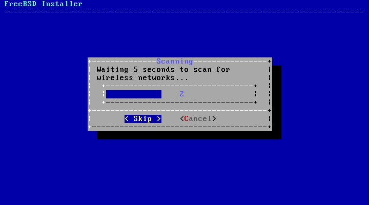
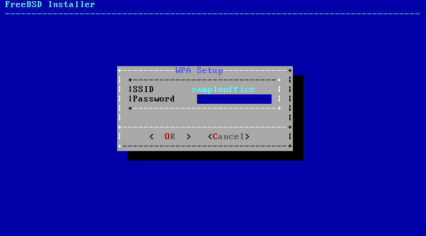
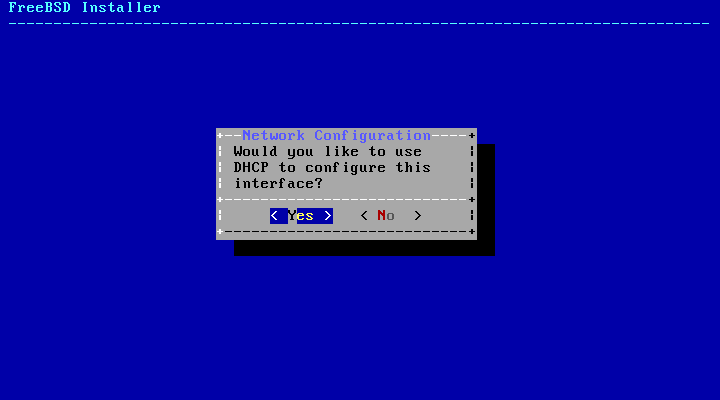
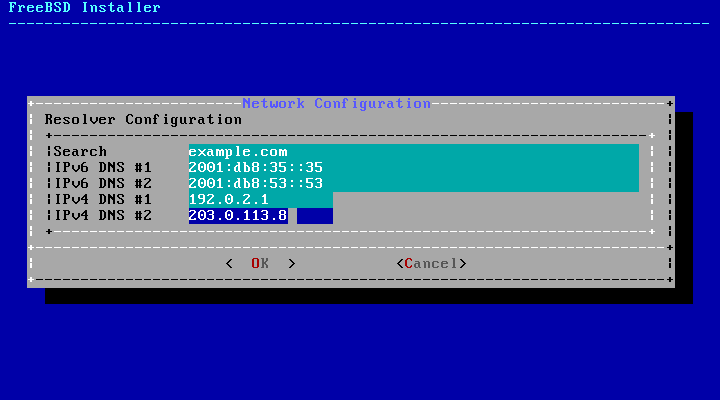
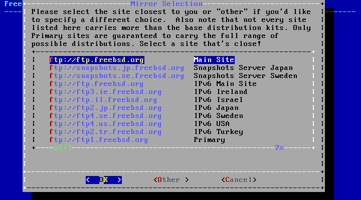

# 2.9.网络接口

## 2.9.1.配置网卡

接下来，会显示计算机上检测到的网卡列表。选择要配置的网卡。

***图 49. 选择网卡***

如果选择了以太网卡，安装程序将跳到[选择 IPv4 网络](https://docs.freebsd.org/en/books/handbook/book/#bsdinstall-configure-net-ipv4)中显示的菜单。如果选择了无线网卡，系统将转而扫描无线接入点：

***图 50. 扫描无线接入点***

无线网络是通过服务集标识（SSID）来识别的，这是一个简短而独特的名称。在扫描过程中会列出发现的 SSID，然后会对该网络可用的加密类型进行说明。如果所需的 SSID 没有出现在列表中，可选择 **Rescan** 再扫描一次。如果想要的网络仍然没有出现，请检查天线的连接是否正常，或尝试将电脑移到离接入点更近的地方，然后再扫描一次。

***图 51. 选择无线网络***

接下来，输入连接到所选无线网络所需的加密方式与连接凭证。强烈建议使用 WPA2 加密，而不是旧的加密类型（如 WEP），后者提供的安全性不高。如果网络使用 WPA2，请输入密码，也被称为预共享密钥（PSK）。出于安全考虑，输入框中的字符会显示为星号。

***图 52. WPA2 设置***

接下来，选择是否要在以太网或无线接口上配置 IPv4 地址。

***图 53. 选择 IPv4 网络***

这里有两种方法可以配置 IPv4。如果网络中有 DHCP 服务器，DHCP 就会自动正确配置网络接口。否则需要手动配置静态网络。

>**注意**
>
>不要随意输入网络信息，因为这没用。如果没有 DHCP 服务器，请从网络管理员或互联网服务提供商那里获得[所需网络信息](https://docs.freebsd.org/en/books/handbook/book/#bsdinstall-collect-network-information)中列出的信息。

如果有 DHCP 服务器，在下一个菜单中选择 **Yes** 来自动配置网络接口。当安装程序找到 DHCP 服务器并获得系统的寻址信息时，会出现一分钟左右的停顿。

***图 54. 选择 IPv4DHCP 配置***

如果没有 DHCP 服务器，请选择 **No**，并在此菜单中输入以下地址信息：

**图 55. 静态 IPv4 配置**

- `IP Address`——分配给该计算机的 IPv4 地址。该地址必须是唯一的，并且没有被本地网络中的其他设备使用。

- `Subnet Mask`——网络的子网掩码。

- `Default Router`——网络的默认网关的 IP 地址。

下一个菜单将询问是否需要为该网卡配置 IPv6。如果需要 IPv6 并且可用，请选择 **Yes** 来选择它。

***图 56. 选择 IPv6 网络***

IPv6 也有两种配置方法。无状态地址自动配置（SLAAC）将自动向本地路由器请求正确的配置信息。更多信息请参考 [rfc4862](http://tools.ietf.org/html/rfc4862)。静态配置需要手动输入网络信息。

如果有 IPv6 路由器，请在接下来的菜单中选择 **Yes**，以自动配置网卡。安装程序在寻找路由器并获取网络信息期间，会出现一分钟左右的停顿。

***图 57. 选择 IPv6 SLAAC 配置***

如果没有 IPv6 路由器，请选择 **No** 并在该菜单中输入以下地址信息：

***图 58. 静态 IPv6 配置**- 

- `IPv6 Address`——分配给该计算机的 IPv6 地址。该地址必须是唯一的，且没有被本地网络中的其他设备使用。

- `Default Router`——网络的默认网关的 IPv6 地址。

最后一个网络配置菜单用于配置域名系统（DNS）解析器，它将主机名转换为网络地址。如果使用了 DHCP 或 SLAAC 配置网卡，那么可能已经填写好了 `Resolver Configuration` 所需的信息。如果没有，在 `Search` 中输入本地网络的域名。在 `DNS #1` 和 `DNS #2` 中填写 DNS 服务器的 IPv4 或者 IPv6 地址。至少需要填写一个 DNS 服务器。

***图 59. DNS 配置***

配置好了网卡，选择某个与安装 FreeBSD 的计算机位于同一地区的镜像站。当所选镜像站靠近目标计算机时，可以更快地下载文件，从而减少安装时间。

***图 60. 选择镜像站***
