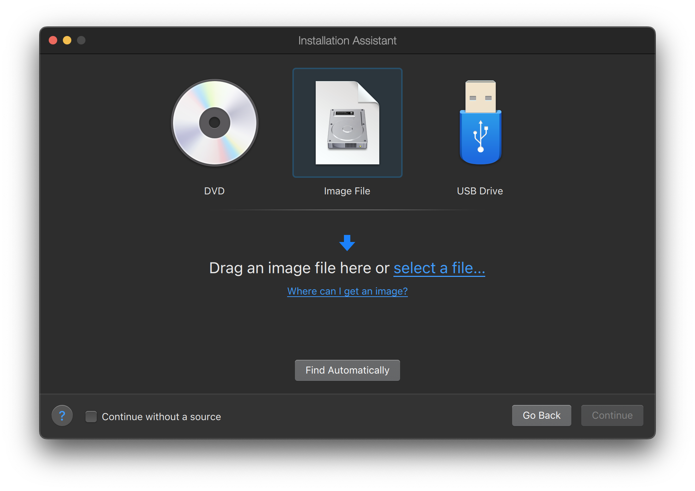
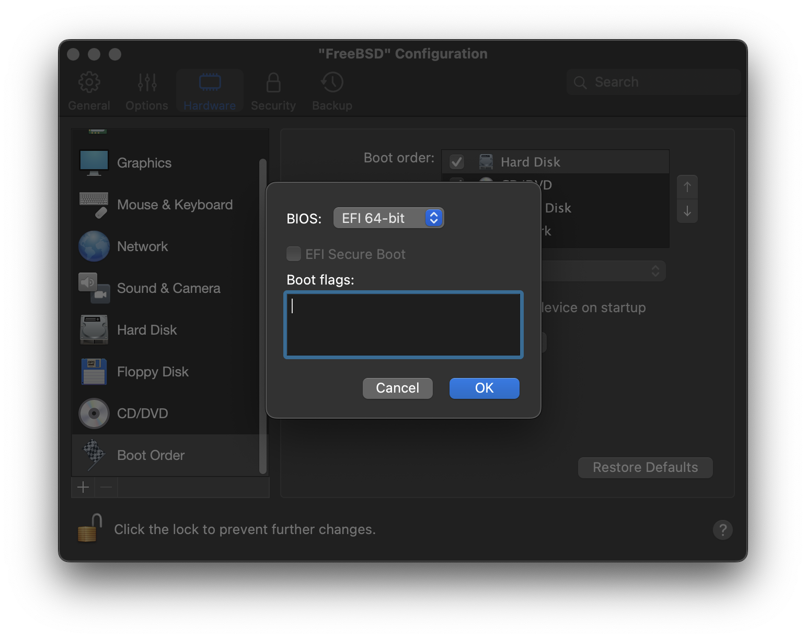
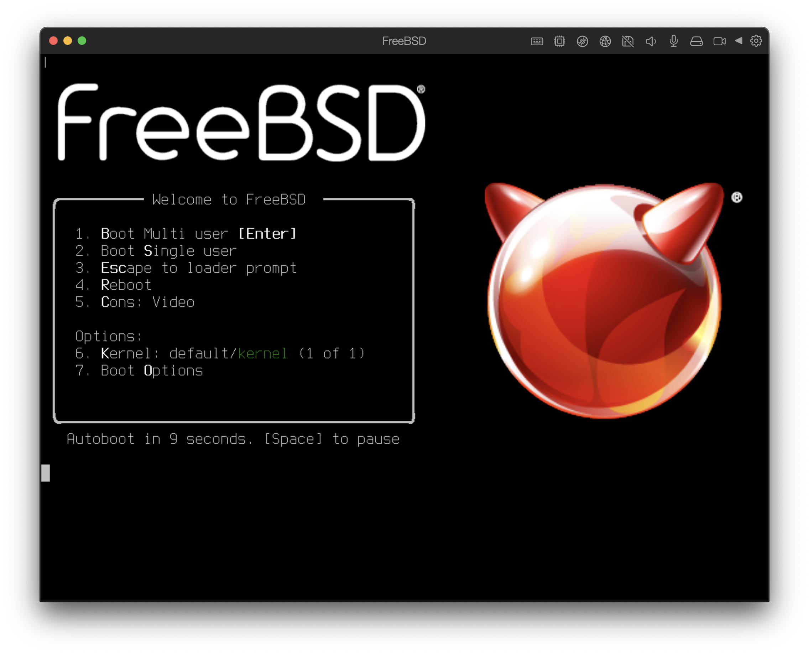

# 23.2.使用 macOS® 上的 Parallels Desktop 安装 FreeBSD

Parallels Desktop for Mac® 是为基于 Intel® 的 Apple® Mac® 计算机所开发的商用软件，支持 macOS® 10.4.6 及更高版本。FreeBSD 是得到其完整支持的客户机系统。在 macOS® 上安装好 Parallels 之后，用户需要配置虚拟机并安装所需的客户机操作系统。

## 23.2.1. 在 Parallels Desktop on Mac® 上安装 FreeBSD

在 Parallels 上安装 FreeBSD 的第一步是创建一个新的用于安装的虚拟机。当出现提示时，选择 FreeBSD 作为**Guest OS Type**：


根据虚拟机的用途，选择适当的磁盘和内存配额。对于大多数用途，4GB 的磁盘空间和 512MB 的内存空间就可以了：






选择网络类型和网络接口：




保存并结束配置：


在创建 FreeBSD 虚拟机之后，你就可以在其中安装 FreeBSD 了。最佳方法是使用官方的 FreeBSD CD/DVD 或是从官方 FTP 站点下载 ISO 镜像。将合适的 ISO 镜像复制到 Mac® 的本地文件系统中，或者将 CD/DVD 插入 Mac® 的 CD-ROM 光驱。点击 Parallels 窗口上的光盘图标，在弹出的窗口中将 ISO 文件或者实体 CD-ROM 光驱关联到虚拟机的 CD-ROM 光驱上。


在关联 CD-ROM 来源之后，点击重启图标重启 FreeBSD 虚拟机，Parallels 内建的 BIOS 会扫描虚拟的 CD-ROM 光驱。


在这种情况下，会识别到 FreeBSD 的安装镜像，然后开始正常的 FreeBSD 安装流程。执行安装，但是不要在这时候尝试安装 Xorg。


安装完成后，重启进入全新安装的 FreeBSD 虚拟机。


## 23.2.2. 在 Parallels 上配置 FreeBSD

在 macOS® 的 Parallels 上成功安装 FreeBSD 之后，可以进行如下几个配置来为虚拟化操作对系统进行优化。

> 1.  设置引导加载器变量
>
>     最重要的一步是调整可优化的 `kern.hz` 来减少 FreeBSD 在 Parallels 环境下的 CPU 使用率。这可通过在 **/boot/loader.conf** 中加入如下一行来实现：
>
>     ```
>     kern.hz=100
>     ```
>
>     在没有此项设置的情况下，Parallels 中运行的 FreeBSD 在闲置状态下会占用大约 15% 的 CPU（在一台搭载单颗处理器的 iMac® 上）。进行设置后，占用率可以降低到 5% 左右。
> 2.  创建新的内核配置文件
>
>     所有 SCSI、火线和 USB 设备驱动都可以从定制内核配置文件中移除。Parallels 提供了一个虚拟网络适配器并使用了驱动 [ed(4)](https://www.freebsd.org/cgi/man.cgi?query=ed\&sektion=4\&format=html)，所以除了 [ed(4)](https://www.freebsd.org/cgi/man.cgi?query=ed\&sektion=4\&format=html) 和 [miibus(4)](https://www.freebsd.org/cgi/man.cgi?query=miibus\&sektion=4\&format=html) 之外的网络驱动都可以从内核中移除。
> 3.  配置网络
>
>     最基本的网络配置使用 DHCP 来将虚拟机连接到宿主机 Mac® 所在的同一个局域网中。这可以通过向 **/etc/rc.conf** 中添加 `ifconfig_ed0="DHCP"` 来实现。更高级的网络设置请参见[高级网络](https://docs.freebsd.org/en/books/handbook/advanced-networking/index.html#advanced-networking)。
