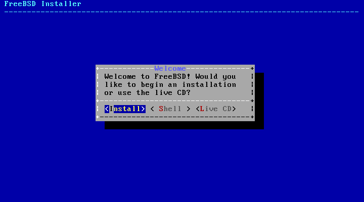

# 2.4. 开始安装

> **重要**
>
> 默认情况下，在出现以下信息之前，安装程序不会对磁盘进行任何修改：
>
> ```
> Your changes will now be written to disk. If you
>have chosen to overwrite existing data, it will
>be PERMANENTLY ERASED. Are you sure you want to
>commit your changes?
>```
>
> 在此之前均可安全退出。如果担心有什么地方配置不正确，只要在这之前关闭计算机，设备的磁盘就不会有任何变化。

本节介绍了如何从安装设备启动系统，安装设备是按照[准备安装介质](https://docs.freebsd.org/en/books/handbook/bsdinstall/#bsdinstall-installation-media)指导准备好的。当使用可启动系统的 U 盘时，在打开计算机之前先插入 U 盘。当从 CD 或 DVD 光盘启动时，请在启动计算机后立即放入光盘。在不同架构的设备下设置系统从插入的设备启动的方式会有所不同。

## 2.4.1.FreeBSD 启动菜单

系统从安装设备启动以后，将显示一个类似于下图的菜单：


***图 1. FreeBSD 启动引导菜单***

在默认情况下，在启动到 FreeBSD 安装程序之前，该菜单会等待 10 秒钟让用户进行输入；如果已安装 FreeBSD，则会出现在引导 FreeBSD 之前。按`空格键`来暂停启动计时器以查看选择。要选择某个选项，按菜单条目对应的高亮数字、字符或按键。以下是可选菜单条目：

- `Boot Multi User`：（多用户模式）这将继续 FreeBSD 的引导过程。如果启动计时器已经暂停，按 `1`，大写或小写的 `B`，或`回车键`继续。

- `Boot Single User`：（单用户模式）此模式可以用来修复现有的 FreeBSD 安装，如 ["单用户模式"](https://docs.freebsd.org/en/books/handbook/boot/index.html#boot-singleuser) 中所述。按 `2` 或大写或小写的 `S` 来进入这个模式。

- `Escape to loader prompt`：（切换至引导提示符）这将引导系统进入修复提示界面，该界面包含有限数量的底层命令。这个提示界面将在 [“第三阶段”](https://docs.freebsd.org/en/books/handbook/boot/index.html#boot-loader) 中进行说明。按 `3` 或 `Esc` 键启动进入这个提示。

- `Reboot`：（重启系统）重启计算机。

-  `Cons`: 允许通过 `显卡`, `串口`, `同时（串口为主）` 或 `同时（显卡为主）` 进行安装。

- `Kernel`：（内核）加载一个不同的内核。

- `Configure Boot Options`：（配置启动参数）打开 [FreeBSD 开机选项菜单](https://docs.freebsd.org/en/books/handbook/book/#bsdinstall-boot-options-menu)中介绍的菜单。


***图 2. FreeBSD 开机选项菜单***

开机选项菜单分为两个部分。第一部分可以用来返回到主启动菜单或将任何已调整的选项重置为默认值。

下一个部分是用来调整可用的选项，通过按下高亮数字或字符来使选项 `On` 或 `Off`。系统将始终使用这些参数启动，直到它们被修改。有几个选项可以通过这个菜单进行调整：

- `ACPI Support`：（ACPI 支持）如果系统在启动过程中挂起，请尝试将该选项切换为 `off`。

- `Safe Mode`：（安全模式）如果即使将 `ACPI Support` 设置为 `Off`，系统在启动时仍然挂起，请尝试将这个选项设置为 `On`。

- `Single User`：（单用户模式）将这个选项切换到`On`来修复现有的 FreeBSD 安装，如[单用户模式](https://docs.freebsd.org/en/books/handbook/boot/index.html#boot-singleuser)中所述。如果问题得到解决了，再将其设置为 `Off` 即可。

- `Verbose`：（详情模式）把这个选项切换到`On`，可以在启动过程中看到更详细的信息。这在排除某个硬件故障时可能很有用。

在做出必要的选择后，按 `1` 或`退格键`键返回主启动菜单，然后按`回车键`继续启动 FreeBSD。当 FreeBSD 进行硬件设备探测并加载安装程序时，会出现一系列的启动信息。启动完成以后，将显示[欢迎菜单](https://docs.freebsd.org/en/books/handbook/book/#bsdinstall-choose-mode)。



***图 3. 欢迎菜单***

按`回车键`，选择默认的 **Install**，进入安装程序。本章的剩余部分将对这个安装程序的使用方法进行介绍。另外，可使用左右箭头或键入彩色字母来选择所需的菜单项。**Shell** 可以用来访问一个 FreeBSD shell，以便在安装前使用命令行工具来对磁盘进行分区。**Live CD** 选项可以用来在安装前先试用 FreeBSD。Live 版本在[使用 Live CD](https://docs.freebsd.org/en/books/handbook/book/#using-live-cd) 中有说明。

>**技巧**
>
>要查看开机信息，包括硬件设备探测，按大写或小写的 `S`，然后按`回车键`可进入 shell。在 shell 提示符下，输入 `more /var/run/dmesg.boot`，并使用`空格键`滚动浏览信息。完成后，键入 `exit` 来返回欢迎菜单。
