# 2.8.网络、账户、时区、服务和安全

## 2.8.1.设置 `root` 密码

首先，必须设置 `root` 密码。在输入密码时，正在输入的字符并不会显示在屏幕上。密码必须输入两次，以防止输入错误。


_**图 34. 设置 root 密码**_

## 2.8.2.网络设置

接下来，会显示计算机上检测到的网卡列表。选择要配置的网卡。


_**图 35. 选择网卡**_

如果选择了以太网卡，安装程序将跳到选择 IPv4 网络中显示的菜单。如果选择了无线网络接口，系统将转而扫描无线接入点。


_**图 36. 扫描无线接入点**_

无线网络是由服务集标识（SSID）来识别的；这是给予每个网络的简短、独特的名称。在扫描过程中发现的 SSID 会被列出，然后是对该网络可用的加密类型的描述。如果所需的 SSID 没有出现在列表中，选择 **Rescan** 以再次扫描。如果想要的网络仍然没有出现，请检查天线连接是否有问题，或者尝试将电脑移到离接入点更近的地方。每次改变后都要 Rescan。

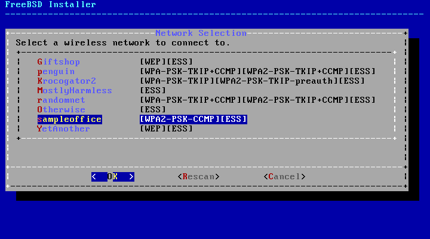

_**图 37. 选择无线网络**_

接下来，输入连接到所选无线网络的加密信息。强烈建议使用 WPA2 加密，而不是旧的加密类型（如 WEP），因为后者提供的安全性不高。如果网络使用 WPA2，请输入密码，也被称为预共享密钥（PSK）。出于安全考虑，输入框中的字符会显示为星号。


_**图 38. WPA2 设置**_

接下来，选择是否要在以太网卡或无线卡上配置 IPv4 地址：


_**图 39. 选择 IPv4 网络**_

有两种方法可以配置 IPv4。DHCP 会自动正确配置网络，如果网络中提供了 DHCP 服务器，就应该使用这种方法。否则，需要以静态配置的方式手动输入寻址信息。

> **注意**
>
> 不要随意输入网络信息，因为这没用。如果没有 DHCP 服务器，请从网络管理员或互联网服务提供商那里获得[所需网络信息](https://docs.freebsd.org/en/books/handbook/book/#bsdinstall-collect-network-information)中列出的信息。

如果有 DHCP 服务器，在下一个菜单中选择 **Yes** 来自动配置网络。当安装程序找到 DHCP 服务器并获得系统的寻址信息时，会出现一分钟左右的停顿。


_**图 40. 选择 IPv4 DHCP 配置**_

如果没有 DHCP 服务器，请选择 **No**，并在此菜单中输入以下寻址信息：


_**图 41. 静态 IPv4 配置**_

- `IP Address` - 分配给该计算机的 IPv4 地址。该地址必须是唯一的，并且没有被本地网络中的其他设备使用。

- `Subnet Mask` - 网络的子网掩码。

- `Default Router` - 网络的默认网关的 IP 地址。

下一屏将询问该接口是否应配置为 IPv6。如果 IPv6 可用并且需要，选择 **Yes** 来选择它。

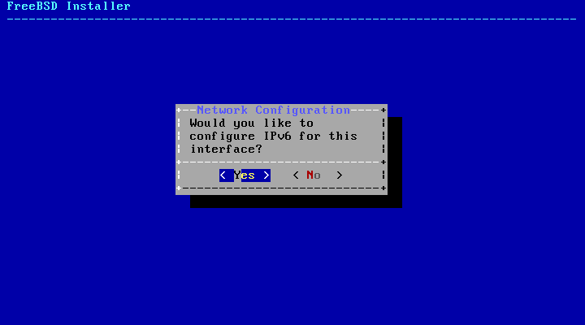

_\**图 42. 选择 IPv6 网络*_

IPv6 也有两种配置方法。无状态地址自动配置（SLAAC）将自动向本地路由器请求正确的配置信息。更多信息请参考 [rfc4862](http://tools.ietf.org/html/rfc4862)。静态配置需要手动输入网络信息。

如果有 IPv6 路由器，请在下一个菜单中选择 **Yes**，以自动配置网络接口。安装程序在找到路由器并获得系统的寻址信息时，会出现一分钟左右的停顿。

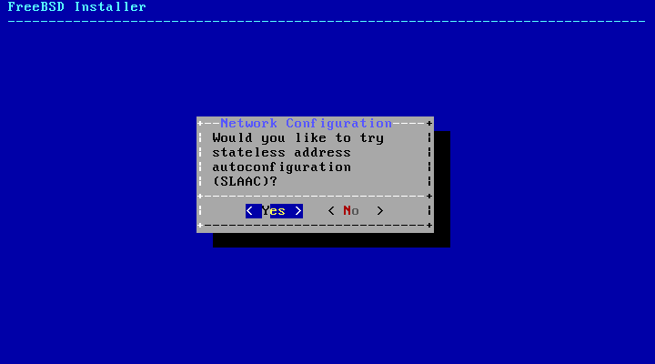

_**图 43. 选择 IPv6 SLAAC 配置**_

如果没有 IPv6 路由器，请选择 **No** 并在该菜单中输入以下寻址信息。

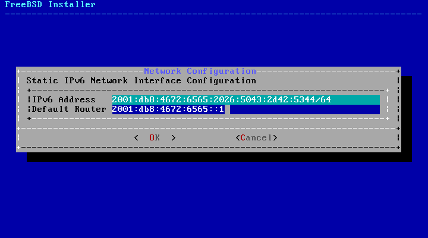

_**图 44. 静态 IPv6 配置**_

- `IPv6 Address` - 分配给该计算机的 IPv6 地址。该地址必须是唯一的，并且没有被本地网络中的其他设备使用。

- `Default Router` - 网络的默认网关的 IPv6 地址。

最后一个网络配置菜单用于配置域名系统（DNS）解析器，它将主机名转换为网络地址。如果使用了 DHCP 或 SLAAC 来自动配置网络，那么 `Resolver Configuration` 的值可能已经被填入。若没有，在 `Search` 中输入本地网络的域名。`DNS #1` 和 `DNS #2` 是 DNS 服务器的 IPv4 / IPv6 地址。至少需要一个 DNS 服务器。


_**图 45. DNS 配置**_

配置好界面后，选择一个与安装 FreeBSD 的计算机位于同一地区的镜像站点。当镜像站点靠近目标计算机时，可以更快地检索到文件，从而减少安装时间。


_**图 46. 选择镜像站**_

## 2.8.3.设置时区

接下来的一系列菜单用于通过选择地理区域、国家和时区来确定正确的本地时间。设置时区可以使系统自动纠正地区时间变化，如夏令时，并正确执行其他与时区有关的功能。

这里显示的例子是针对位于欧洲西班牙大陆时区的机器。根据地理位置的不同，选择也会有所不同。


_**图 47. 选择区域**_

使用方向键选择适当的区域，然后按`回车键`。


_**图 48. 选择国家**_

用方向键选择适当的国家，然后按`回车键`。


_**图 49.设置时区**_

使用箭头键选择适当的时区并按下`回车键`。


_**图 50. 确认时区**_

确认时区的缩写是正确的。


_**图 51. 选择日期**_

使用方向键选择适当的日期，然后按 **Set Date**。否则，可以通过按 **Skip** 来跳过日期的选择。

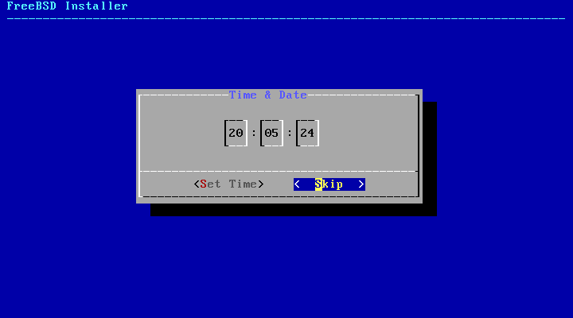

_**图 552. 选择时间**_

使用方向键选择适当的时间，然后按 **Set Time**。否则，可以通过按 **Skip** 来跳过时间的选择。

## 2.8.4.开启服务

接下来的菜单用于配置哪些服务会开机自启。所有这些服务都是可选的。只需启动系统运行所需的服务。

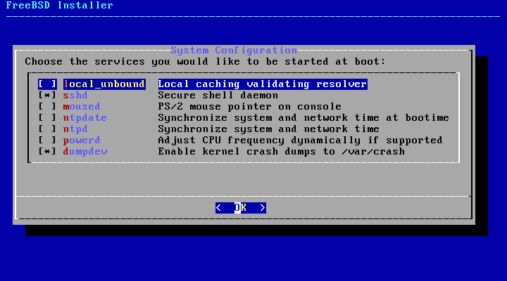

_**图 53. 选择要开启的其他服务**_

这里是在这个菜单中可以启用的服务摘要：

- `local_unbound`——启用本地 DNS 的 unbound。请牢记，这是一个仅用于作为本地缓存转发解析器的配置。如果目标是为整个网络建立解析器，请安装 [dns/unbound](https://cgit.freebsd.org/ports/tree/dns/unbound/pkg-descr)。
- `sshd`——Secure Shell（SSH）守护程序用于经过加密的连接远程访问系统。只有在系统允许远程登录时才启用这个服务。
- `moused`——如果要在命令行系统控制台使用鼠标，则启用该服务。
- `ntpdate`——启用开机时的自动时钟同步功能。注意这个程序的功能现在在守护进程 [ntpd(8)](https://www.freebsd.org/cgi/man.cgi?query=ntpd&sektion=8&format=html) 中可用， [ntpdate(8)](https://www.freebsd.org/cgi/man.cgi?query=ntpdate&sektion=8&format=html) 工具将很快退役。
- `ntpd`——用于自动时钟同步的网络时间协议（NTP）的守护进程。如果你希望将你的系统时钟与远程时间服务器或池同步，请启用这项服务。
- `powerd`——系统的电源控制工具，用于电源控制和节能。
- `dumpdev`——崩溃转储在调试系统故障时很有用，所以推荐用户启用它。

## 2.8.4.启用安全加固选项

接下来的菜单是用来配置启用安全选项。所有这些选项都是可选的。但我们推荐开启它们。

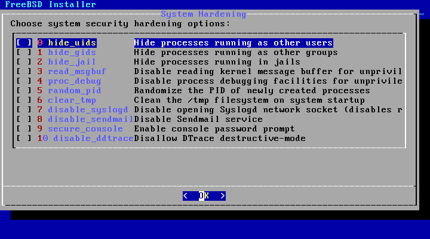

_**图 54. 启用安全加固选项**_

下面是这个菜单中可以启用的选项的摘要：

- `hide_uids`——隐藏以其他用户身份运行的进程（UID）。这可以防止没有特权的用户看到其他用户的运行进程。
- `hide_gids`——隐藏以其他组的名义运行的进程（GID）。这可以防止没有特权的用户看到其他组的运行进程。
- `hide_jail`——隐藏在 jail 中运行的进程。这可以防止没有特权的用户看到在 jail 内运行的进程。
- `read_msgbuf`——禁止非特权用户使用 [dmesg(8)](https://www.freebsd.org/cgi/man.cgi?query=dmesg&sektion=8&format=html) 查看内核日志缓冲区的信息，以防止读取内核缓冲区中的信息。
- `proc_debug`——禁用非特权用户的进程调试功能，禁用各种非特权的进程间调试服务，包括一些 procfs 功能、`trace()` 和 `ktrace()`。请注意，这也会妨碍调试工具，例如 [lldb(1)](https://www.freebsd.org/cgi/man.cgi?query=lldb&sektion=1&format=html)、[truss(1)](https://www.freebsd.org/cgi/man.cgi?query=truss&sektion=1&format=html)、[procstat(1)](https://www.freebsd.org/cgi/man.cgi?query=procstat&sektion=1&format=html)，以及某些脚本语言（如 PHP）中的一些内置调试功能。
- `random_pid`——进程 PID 随机化。
- `clear_tmp`——在系统启动时清理 **/tmp**。
- `disable_syslogd`——禁止打开 syslogd 网络套接字。在默认情况下，FreeBSD 以安全的方式使用 `-s` 参数运行 syslogd。这可以防止守护进程在 514 端口监听传入的 UDP 请求。启用该选项后，syslogd 将以标志 `-ss` 运行，它可以阻止 syslogd 打开任何端口。要获得更多信息，请参考 [syslogd(8)](https://www.freebsd.org/cgi/man.cgi?query=syslogd&sektion=8&format=html)。
- `disable_sendmail`——禁用 sendmail 邮件传输代理。
- `secure_console`——在进入单用户模式时，命令提示符会要求输入 `root` 密码。
- `disable_ddtrace`——Dtrace 在某些运行模式下可能会对内核的正常运行造成影响。除非用户明确启用，否则不得使用该破坏性操作。要在使用 DTrace 时启用该选项，请使用参数 `-w`。如需更多信息，请查阅 [dtrace(1)](https://www.freebsd.org/cgi/man.cgi?query=dtrace&sektion=1&format=html)。
- `enable_aslr` -启用地址空间布局随机化。关于地址空间布局随机化的更多信息，可以参考[维基百科的文章](https://en.wikipedia.org/wiki/Address_space_layout_randomization)。

## 2.8.5.添加用户

接下来的菜单提示至少要创建一个用户账户。建议使用非 `root` 的用户账户身份登录系统。当以 `root` 身份登录时，基本上任何事都没有限制或保护。以普通用户身份登录更安全、更有保障。

选择 **Yes** 来添加新用户。

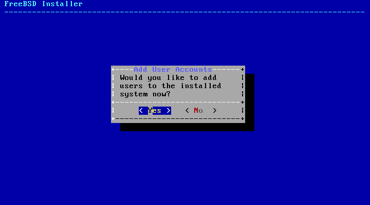

_**图 55. 添加用户**_

按照提示，输入所要求的用户账户信息。[输入用户信息](https://docs.freebsd.org/en/books/handbook/book/#bsdinstall-add-user2)中显示的例子创建了一个名为 `asample` 的账户。

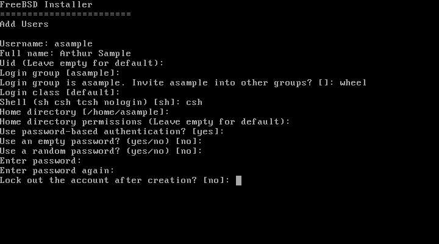

_**图 56. 输入用户信息**_

此处是需要输入的信息的摘要：

- `Username`——用户登录时要输入的名字。常见的惯例是使用名字的第一个字母与姓氏相结合，只要每个用户名对系统来说是唯一的即可。用户名区分大小写且不应包含任何空格。
- `Full name`——用户的全名。作为用户账户的说明，可以包含空格，。
- `Uid`——用户 ID。通常留空，系统会自动分配一个值。
- `Login group`——组。通常留空，使用默认值。
- `Invite user into other groups?`——额外的组，用户将被添加为成员。如果用户需要管理权限，在这里输入 `wheel`。
- `Login class`——通常留空，使用默认值。
- `Shell`——键入列表中的一项来设置用户的交互式 shell。关于 shell 的更多信息，请参考 [shells](https://docs.freebsd.org/en/books/handbook/basics/index.html#shells)。
- `Home directory`——用户主目录。通常使用默认值。
- `Home directory permissions`——用户主目录的权限。通常使用默认值。
- `Use password-based authentication?`——通常回答 `yes`，这样用户在登录时就会被提示输入他们的密码。
- `Use an empty password?`——通常是 `no`，因为空白的密码是不安全的。
- `Use a random password?`——通常是 `no`，这样用户可以在下一个提示中设置自己的密码。
- `Enter password`——输入用户的密码。输入的字符不会被显示在屏幕上。
- `Enter password again`——必须再次输入密码进行验证。
- `Lock out the account after creation?`——通常是 `no`，这样用户就可以登录。

在输入所有详细信息后，会显示一个摘要供复核。如果输错了什么，输入 `no`，然后再试一次。如果一切正确，输入 `yes` 来完成新用户的创建。

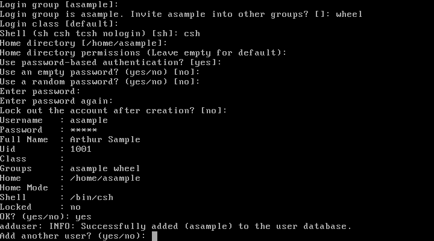

_**图 57. 退出用户与用户管理**_

如果需要添加更多的用户，请在 `Add another user?` 这个问题上回答 `yes`。输入 `no` 可完成添加用户步骤并继续安装。

关于添加用户和用户管理的更多信息，请参阅[用户和基本账户管理](https://docs.freebsd.org/en/books/handbook/basics/index.html#users-synopsis)。

## 2.8.7.最终配置

在所有东西都被安装和配置好之后，会提供最后一次修改设置的机会。


_**图 58. 最终配置**_

在完成安装之前，使用此菜单进行任何修改或做任何额外的配置。

- `Add User`——在[添加用户](https://docs.freebsd.org/en/books/handbook/book/#bsdinstall-addusers)中说明。
- `Root Password`——在[设置 root 密码](https://docs.freebsd.org/en/books/handbook/book/#bsdinstall-post-root)章节中说明。
- `Hostname`——在[设置主机名](https://docs.freebsd.org/en/books/handbook/book/#bsdinstall-hostname)章节中说明。
- `Network`——在[配置网络接口](https://docs.freebsd.org/en/books/handbook/book/#bsdinstall-config-network-dev)章节中说明。
- `Services`——在[启用服务章节](https://docs.freebsd.org/en/books/handbook/book/#bsdinstall-sysconf)中说明。
- `System Hardening`——在[启用加固安全](https://docs.freebsd.org/en/books/handbook/book/#bsdinstall-hardening)选项中说明。
- `Time Zone`——在[设置时区章节](https://docs.freebsd.org/en/books/handbook/book/#bsdinstall-timezone)中进行了说明。
- `Handbook`——下载并安装 FreeBSD 手册。

在完成配置后，选择 **Exit**。

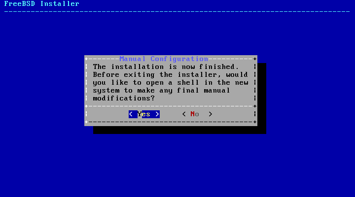

_**图 59. 手动配置**_

bsdinstall 会提示是否有任何额外的配置需要在重启到新系统之前完成。选择 **Yes** 会进入到新系统的 shell，或者选择 **No** 进入安装的最后步骤。


_**图 60. 安装完成**_

如果需要做进一步的配置或特殊的设置，选择 **Live CD** 来启动安装设备进入 Live CD 模式。

如果安装完成，选择 **Reboot** 来重新启动计算机并开始使用新的 FreeBSD 系统。不要忘记移除 FreeBSD 的安装介质，否则计算机可能会再次进入安装程序。

当 FreeBSD 启动时，会显示许多可供参考的信息。在系统完成启动后，会显示登录提示：在 `login:` 的提示下，输入安装时添加的用户名。避免以 `root` 身份登录。了解关于在需要管理权限时如何成为超级用户的说明，请参考[超级用户](https://docs.freebsd.org/en/books/handbook/basics/index.html#users-superuser)。

按 `Scroll-Lock` 键打开缓冲区，就可以查看启动时出现的信息。可以用 `PgUp`、`PgDn` 和方向键来回滚信息。完成后，再按一次 `Scroll-Lock` 键，解除画面锁定并返回到控制台。要在系统开机一段时间后查看这些信息，可以在命令提示符下输入 `less /var/run/dmesg.boot`。查看后按 `q` 键返回到命令行。

如果在[选择要开启的其他服务](https://docs.freebsd.org/en/books/handbook/book/#bsdinstall-config-serv)中启用了 `sshd`，第一次启动时可能会慢一些，因为系统会生成 SSH 主机密钥。后续的启动会恢复正常速度。然后会显示密钥的指纹，如下例所示：

```shell-session
Generating public/private rsa1 key pair.
Your identification has been saved in /etc/ssh/ssh_host_key.
Your public key has been saved in /etc/ssh/ssh_host_key.pub.
The key fingerprint is:
10:a0:f5:af:93:ae:a3:1a:b2:bb:3c:35:d9:5a:b3:f3 root@machine3.example.com
The key's randomart image is:
+--[RSA1 1024]----+
|    o..          |
|   o . .         |
|  .   o          |
|       o         |
|    o   S        |
|   + + o         |
|o . + *          |
|o+ ..+ .         |
|==o..o+E         |
+-----------------+
Generating public/private dsa key pair.
Your identification has been saved in /etc/ssh/ssh_host_dsa_key.
Your public key has been saved in /etc/ssh/ssh_host_dsa_key.pub.
The key fingerprint is:
7e:1c:ce:dc:8a:3a:18:13:5b:34:b5:cf:d9:d1:47:b2 root@machine3.example.com
The key's randomart image is:
+--[ DSA 1024]----+
|       ..     . .|
|      o  .   . + |
|     . ..   . E .|
|    . .  o o . . |
|     +  S = .    |
|    +  . = o     |
|     +  . * .    |
|    . .  o .     |
|      .o. .      |
+-----------------+
Starting sshd.
```

关于密钥指纹和 SSH 的更多信息请参考 [OpenSSH](https://docs.freebsd.org/en/books/handbook/security/index.html#openssh)。

FreeBSD 不会预装图形界面。请参考 [X Window 系统](https://docs.freebsd.org/en/books/handbook/x11/index.html#x11)以了解更多关于安装和配置图形化窗口管理器的信息。

正确地关闭 FreeBSD 计算机有助于保护数据和硬件免受损害。**在系统尚未正常关机之前，请不要切断电源！** 若用户是 `wheel` 的成员，可在命令行输入 `su` 并输入 root 密码，成为超级用户。然后输入 `shutdown -p now`，系统就会干净利落地关机，如果硬件支持，就会自动切断电源。
