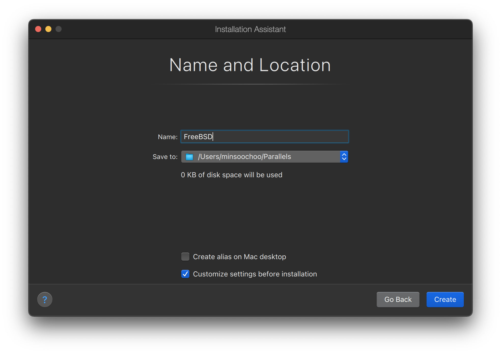
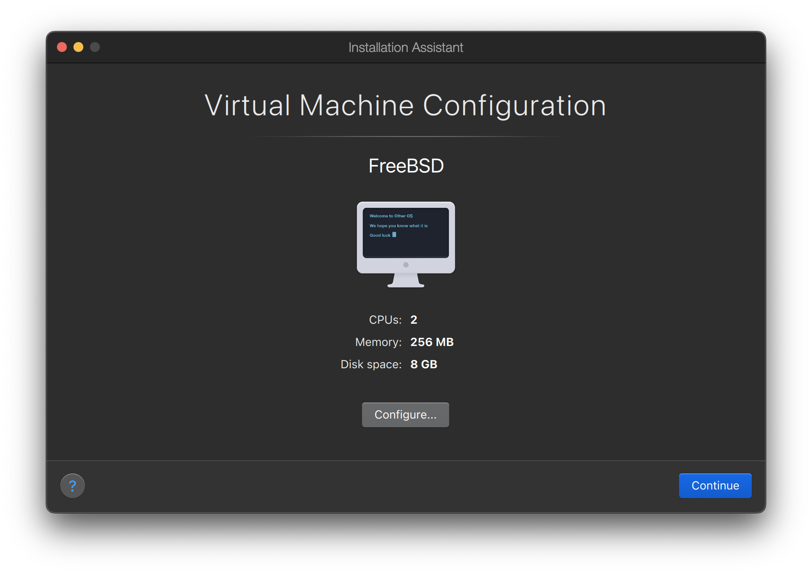

# 24.2.使用 macOS® 上的 Parallels Desktop 安装 FreeBSD

Parallels Desktop for Mac® 是为 Apple® Mac® 计算机所开发的商用软件，支持 macOS® 10.14.6 及更高版本。FreeBSD 是得到其完整支持的客户机系统。在 macOS® 上安装好 Parallels 之后，用户需要配置虚拟机并安装所需的客户机操作系统。

## 24.2.1.在 Parallels Desktop on Mac® 上安装 FreeBSD

在 Parallels 上安装 FreeBSD 的第一步是创建一个新的用于安装的虚拟机。

选择**从 DVD 或镜像文件安装 Windows 或其他操作系统**，然后继续。


选择 FreeBSD 镜像文件。


选择**其他操作系统**。


> 警告
>
> 选择 FreeBSD 会在启动时导致引导错误。

为虚拟机命名并检查**自定义设置**



弹出配置窗口时，进入**硬件**标签页，选择**启动顺序**，单击**高级**。然后选择 **EFI 64-bit** 作为 **BIOS**。


单击**确定**，关闭配置窗口，单击**继续**。



虚拟机将自动引导。按照常规步骤安装 FreeBSD。


## 24.2.2.在 Parallels 上配置 FreeBSD

在 macOS® 的 Parallels 上成功安装 FreeBSD 之后，可以进行如下几个配置来对虚拟化操作系统进行优化。

> 1.  设置引导加载器变量
>
>     最重要的一步是调整可优化的 `kern.hz` 来减少 FreeBSD 在 Parallels 环境下的 CPU 使用率。这可通过在 **/boot/loader.conf** 中加入如下一行来实现：
>
>     ```shell-session
>     kern.hz=100
>     ```
>
>     在没有此项设置的情况下，Parallels 中运行的 FreeBSD 在闲置状态下会占用大约 15% 的 CPU（在一台搭载单颗处理器的 iMac® 上）。进行设置后，占用率可以降低到 5% 左右。
>
> 2.  创建新的内核配置文件
>
>     所有 SCSI、火线和 USB 设备驱动都可以从定制内核配置文件中移除。Parallels 提供了一个虚拟网络适配器并使用了驱动 [ed(4)](https://www.freebsd.org/cgi/man.cgi?query=ed&sektion=4&format=html)，所以除了 [ed(4)](https://www.freebsd.org/cgi/man.cgi?query=ed&sektion=4&format=html) 和 [miibus(4)](https://www.freebsd.org/cgi/man.cgi?query=miibus&sektion=4&format=html) 之外的网络驱动都可以从内核中移除。
>
> 3.  配置网络
>
>     最基本的网络配置使用 DHCP 来将虚拟机连接到宿主机 Mac® 所在的同一个局域网中。这可以通过向 **/etc/rc.conf** 中添加 `ifconfig_ed0="DHCP"` 来实现。更高级的网络设置请参见[高级网络](https://docs.freebsd.org/en/books/handbook/advanced-networking/index.html#advanced-networking)。
