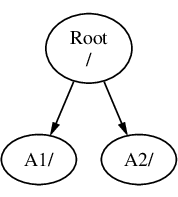
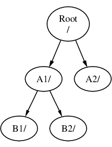
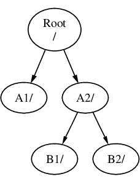
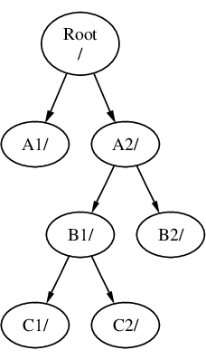

# 3.6.磁盘结构

FreeBSD 用来查找文件的最小组织单位是文件名。文件名区分大小写，这意味着 **readme.txt** 和 **README.TXT** 是两个独立的文件。FreeBSD 并不使用文件的扩展名来确定该文件是程序、文档还是其他形式的数据。

文件被存储在目录中。一个目录可能不包含任何文件，也可能包含数百个文件。目录之中也可以包含其他目录，在目录之间构建层次结构，以便组织数据。

文件和目录的引用方法是给出文件或目录的名称，后面是一个正斜杠，`/`，后面是任何其他必要的目录名称。例如，如果目录 **foo** 包含了一个目录 **bar**，这个目录又包含了一个文件叫 **readme.txt**，那么该文件的全名或 _路径_ 就是 **foo/bar/readme.txt**。请注意，这与 Windows® 不同，后者使用 `\` 来分隔文件和目录名。FreeBSD 在路径中不使用磁盘字母或其磁盘名称。例如，在 FreeBSD 上，人们不会输入 **c:\foo\bar\readme.txt**。

目录和文件存储在文件系统中。每个文件系统在最顶层都有唯一的一个目录，称为该文件系统的 _根目录_。这个根目录可以包含其他目录。会有一个文件系统被指定为 _根文件系统_ 或 `/`，然后其他所有的文件系统都 _挂载_ 在根文件系统下。无论 FreeBSD 系统上有多少个磁盘，所有目录看起来都是同一个磁盘的一部分。

假设有三个文件系统，分别称为 `A`、`B` 和 `C`。每个文件系统有一个根目录，其中包含另外两个目录，称为 `A1`、`A2`（同样地有，`B1`、`B2` 和 `C1`、`C2`）。

称 `A` 为根文件系统。如果用 [ls(1)](https://www.freebsd.org/cgi/man.cgi?query=ls&sektion=1&format=html) 来查看这个目录的内容，它将显示两个子目录，`A1` 和 `A2`。该目录树看起来像这样：

一个文件系统必须以目录形式被挂载到另一个文件系统上。当把文件系统 `B` 挂载到 `A1` 的目录上时，`B` 的根目录变成了 `A1`，`B` 中的目录也相应地发生改变：

任何位于 `B1` 或 `B2` 目录下的文件都必须经过路径 **/A1/B1** 或 **/A1/B2** 才能到达。任何在 `/A1` 中原有的文件都被暂时隐藏了。如果把 `B` 从 `A` 上 _卸载_ 下来，它们将重新出现。

如果 `B` 被挂载在 `A2` 上，那么图片会是这样的：

而路径将分别为 **/A2/B1** 和 **/A2/B2**。

文件系统可以被挂载在其他文件的之上。继续上一个例子，文件系统 `C` 可以挂载在文件系统 `B` 的 B1 目录之上，从而形成这种安排：

或者可以直接挂载 `C` 到文件系统 `A` 的 `A1` 目录下：

完全可以有一个大的根文件系统，而不需要创建任何其他的文件系统。这种方法有既有缺点，也有优点。

多个文件系统的好处

- 不同的文件系统可以有不同的 _挂载选项_。例如，根文件系统可以被挂载为只读，避免用户在无意中删除或编辑一个关键文件。将用户可写的文件系统，如 **/home**，与其他文件系统分开，允许它们被挂载为 *nosuid*。该选项可以使存储在文件系统上的可执行文件的 *suid/guid* 位失效，从而可能提高安全性。

- FreeBSD 会根据文件系统的使用情况，自动优化文件系统上的文件分布。因此，包含许多经常被写入小文件的文件系统与只包含几个大文件的文件系统的优化方式是不同的。如果一个大的文件系统，这种优化将不存在。

- FreeBSD 的文件系统在断电的情况下依旧能保持稳定。然而，在关键时刻上断电仍然可能会破坏文件系统的结构。通过将数据分散存储到多个文件系统中，会提高文件系统在意外断电后仍能正常工作的可能性，并且在必要时更容易从备份中恢复。

单一文件系统的好处

- 文件系统的大小是固定的。如果你在安装 FreeBSD 时创建了一个文件系统，并给了它一个特定的大小，你可能会在后来发现你需要把这个分区做得更大。如果不进行备份，以新的大小重新创建文件系统，然后再恢复备份的数据，这是很难做到的。

>
> **重要**
>
>FreeBSD 的特色命令 [growfs(8)](https://www.freebsd.org/cgi/man.cgi?query=growfs&sektion=8&format=html)，使其可以即时增加文件系统的大小，从而消除这一限制。

文件系统被包含在分区中。由于 FreeBSD 沿袭 UNIX® 传统，这与分区一词的通常用法（例如 MS-DOS® 分区）的含义不同。每个分区由一个从 `a` 到 `h` 的字母标识。每个分区只能包含一个文件系统，这意味着在表示文件系统时，除了用它们在文件系统中的挂载点，还可以用它们所包含的分区的字母来表示。

FreeBSD 还使用磁盘空间作为 _交换空间_ 来提供 _虚拟内存_。这使你的计算机表现得好像它的内存比实际的要多得多。当 FreeBSD 的内存用完时，它会把一些目前没有被使用的数据移到交换空间，当它需要时再把它移回来（把别的东西移出来）。

有些分区有某些与之相关的惯例。

|  分区 |惯例|
| :---: | :---: |
|  `a`  | 通常包含根文件系统。|
|  `b`  | 通常包含交换空间。|
|  `c`  | 通常情况下，它的大小与主分区相同。这可使需要在整个主分区上工作的工具，如坏块扫描器，在分区 `c` 上工作。通常不会在这个分区上创建文件系统。|
|  `d`  | 分区 `d` 曾经有一个与之相关的特殊含义，虽然现在已经消失了，所以现在 `d` 和一般的分区作用相同。|

FreeBSD 中的磁盘被划分为 slice，在 Windows® 中被称为分区，其编号从` 1` 到` 4`。然后，这些 slice 被划分为包含文件系统的分区，并使用字母进行标记。

slice 编号跟在设备名称后面，以 `s` 为前缀，从 `1` 开始。所以 `da0s1` 是第一个 SCSI 驱动器上的第一个 slice。一个磁盘上只能有四个物理 slice，但在适当类型的物理分区内可以有逻辑 slice。这些扩展 slice 的编号从 `5` 开始，所以 `ada0s5` 是第一个 SATA 磁盘上的第一个扩展 slice。这些设备被期望占据一个 slice 的文件系统所使用。

slice、“危险专用”物理驱动器和其他驱动器包含分区，这些分区用从 `a` 到 `h` 的字母表示。这个字母被附加到设备名称上，所以 `da0a` 是第一个`da` 磁盘上的 `a` 分区，它是“危险专用”。“ada1s3e”是第二个 SATA 磁盘驱动器第三个 slice 中的第五个分区。

最后，系统中的每个磁盘都被识别。磁盘名称的开头是一个表示磁盘类型的代码，然后是一个数字，表示它是哪一个磁盘。与 Slice 不同，磁盘的编号从 0 开始，常见的代码在[磁盘设备名称](https://docs.freebsd.org/en/books/handbook/book/#disks-naming)中列出。

当提及一个分区时，应包括磁盘名称、`s`、 slice 编号，然后是分区字母。示例为[磁盘、Slice 和分区名称](https://docs.freebsd.org/en/books/handbook/book/#basics-disk-slice-part)。

[磁盘的概念模型](https://docs.freebsd.org/en/books/handbook/book/#basics-concept-disk-model)展示了一个磁盘布局的概念模型。

在安装 FreeBSD 时，要配置磁盘 slice，在 slice 内创建用于 FreeBSD 的分区，在每个分区创建一个文件系统或交换空间，并决定每个文件系统的挂载位置。

**表 4. 磁盘设备名称**

|            设备类型           |  驱动器设备名称    |
| :---: | :---: |
|        SATA 和 IDE 磁盘驱动器       |      `ada`    |
|      SCSI 磁盘驱动器和 USB 存储设备     |    `da` |
|           NVMe 存储           |   `nvd` 或 `nda`    |
| SATA 与 IDE CD-ROM 驱动器 | `cd`                |
|        SCSICD-ROM 驱动器       |       `cd` |
|            软盘驱动器           |     `fd`    |
|           SCSI 磁带机          |            `sa`     |
|           RAID 驱动器          | 例如，Adaptec® AdvancedRAID 的 `aacd`，Mylex® 的 `mlxd` 和 `mlyd`，AMI MegaRAID® 的 `amrd`，Compaq Smart RAID 的 `idad`，3ware® RAID 的 `twed`。|

>
> **表 5. 磁盘、Slice 和分区名称示例**
>
>|    命名   | 意义   |
>| :-----: | :---: |
>| `ada0s1a` |	第一块 SATA 硬盘（`ada0`）上第一个 slice（`s1`）的第一个分区（`a`）。|
>|  `da1s2e` | 第二块 SCSI 磁盘（`da1`）上的第二个 slice（`s2`）的第五个分区（`e`）。|

>
> **例 13. 磁盘的概念模型**
>
>这张图显示了 FreeBSD 对连接到系统的第一个 SATA 磁盘的内部视角。假设该磁盘的大小为 250 GB，包含一个 80 GB 的分区和一个 170 GB 的 slice（MS-DOS® 分区）。第一个 slice 包含一个 Windows® NTFS 文件系统 **C：**，第二个 slice 包含一个 FreeBSD 系统。这个 FreeBSD 系统实例有四个数据分区和一个交换分区。
>
>这四个分区分别存放一个文件系统。分区 `a` 用于 `/` 文件系统，`d` 用于 **/var/**，`e` 用于 **/tmp/**，`f` 用于 **/usr/**。分区字母 `c` 指的是整个 slice，所以不用于普通分区。
>
>
>
